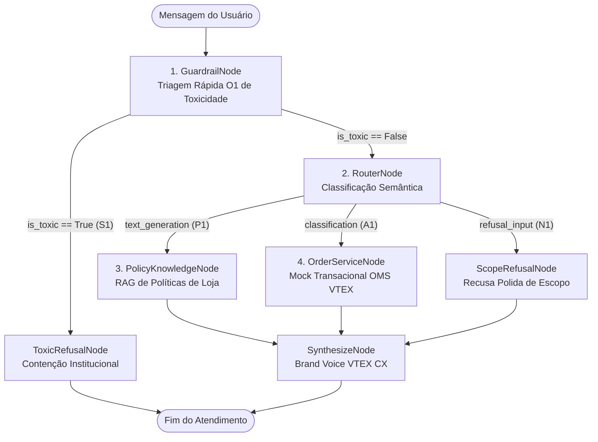

# VTEX CX Platform — Desafio Técnico (Estágio em Ciência de Dados)

> **Candidato:** Luiz Gabriel Correia dos Santos  
> **Destinatário:** Time de Modelos de IA — VTEX CX Platform    
> **Finalidade:** Repositório oficial contendo a resolução integral das duas etapas do teste técnico para a vaga de Estágio em Ciência de Dados.

---

##  Sumário Executivo & Navegação Rápida

O projeto está estruturado de forma modular e reproduzível em dois notebooks centrais:

| Etapa | Entregável Principal | Foco Técnico | Status |
| :---: | :--- | :--- | :---: |
| **1ª Etapa** | [`primeira_etapa/eda_wenieval_vtex.ipynb`](primeira_etapa/eda_wenieval_vtex.ipynb) | **Análise Exploratória de Dados (EDA):** Caracterização estatística multidimensional, orçamentos de tokens, integridade de ground truth e auditoria taxonômica no dataset `Weni/WeniEval-Benchmark-2.0.0`. | **Concluído (100%)** |
| **2ª Etapa** | [`segunda_etapa/agente_ia_vtex.ipynb`](segunda_etapa/agente_ia_vtex.ipynb) | **Agente de IA Generativa:** Orquestração com LangGraph (`StateGraph`), Tool Calling em políticas comerciais e OMS VTEX, guardrails de segurança e motor dual de inferência. | **Concluído (100%)** |

---

## Síntese da 1ª Etapa: Análise Exploratória (EDA WeniEval)

A análise foi conduzida sobre o benchmark `Weni/WeniEval-Benchmark-2.0.0` ($3.887$ registros $\times$ $18$ colunas), concebido para avaliar agentes conversacionais de Customer Experience (CX):

1. **Taxonomia das 4 Tarefas Fundamentais:**
   * $44{,}3\%$ Geração Factual via FAQ/RAG (`text_generation`, gabarito $P1$).
   * $20{,}4\%$ Triagem de Intenção / Operações de Suporte (`classification`, gabarito $A1\text{--}A8$).
   * $20{,}0\%$ Consultas Fora de Escopo (`refusal_input`, gabarito $N1$).
   * $15{,}4\%$ Guardrails de Segurança e Toxicidade (`refusal_toxic_behavior`, gabarito $S1$).
2. **Gargalo de Infraestrutura e Tokens:**
   * Constatou-se que a pergunta do usuário consome apenas $\approx 1{,}0\%$ dos tokens do prompt ($\approx 16$ tokens). O contexto de RAG (`chunks_big`) e as alternativas de intenção (`classes`) concentram mais de **$80\%$ de todo o volume de tokens** injetado no modelo a cada chamada, definindo a latência e o custo de produção.
3. **Descoberta da Causa Raiz de Nulos em `type_question`:**
   * O cruzamento sistemático revelou que $100\%$ dos $2.591$ valores `'nan'` pertencem aos idiomas inglês e espanhol, decorrentes de falha de propagação no pipeline de internacionalização da Weni. No português, as $172$ ausências pertencem exclusivamente à tarefa de toxicidade ($S1$). Demonstrou-se a recuperação total dos atributos via cruzamento determinístico pela chave canônica `id`.
4. **Integridade do Ground Truth:**
   * Auditoria matemática comprovando que $100{,}00\%$ dos casos de classificação transacional possuem o rótulo `chosen_class_id` rigorosamente presente no catálogo `classes`.

---

##  Síntese da 2ª Etapa: Agente de IA da VTEX CX Platform

A 2ª Etapa consistiu na concepção e prototipação do Agente de Atendimento ao Cliente da VTEX CX Platform:



### Destaques de Engenharia
* **LangGraph (`StateGraph`):** Orquestração orientada a estados com controle fino de transição, alta auditabilidade e separação explícita de responsabilidades.
* **Guardrails Híbridos:** Interceptação determinística $O(1)$ de insultos e agressões antes do acionamento de RAG ou modelos de linguagem, economizando custos computacionais para os $15{,}4\%$ de consultas tóxicas.
* **Tool Calling Transacional:** Ferramenta `VTEXOrderServiceMock` que valida conformidade com o Código de Defesa do Consumidor (CDC) e políticas comerciais de loja (janela de 7 dias para arrependimento e 30 dias para troca de calçados/vestuário), gerando autorização de postagem reversa dos Correios.
* **Motor Dual de Inferência (Reprodutibilidade Garantida):**
  * *Modo Online:* Conexão transparente via Google Gemini API (`gemini-2.5-flash`).
  * *Modo Offline Determinístico:* Fallback automático para o arquivo [`segunda_etapa/data/cached_inferences.json`](segunda_etapa/data/cached_inferences.json) (auditado pelo autor), com rotina de download resiliente caso o notebook seja aberto de forma avulsa no Google Colab.

---

##  Como Reproduzir o Projeto Localmente

### 1. Clonar o Repositório
```bash
git clone https://github.com/LuizCorrei4/estagio_vtex.git
cd estagio_vtex
```

### 2. Criar e Ativar Ambiente Virtual
```bash
python3 -m venv .venv
source .venv/bin/activate  # No Windows: .venv\Scripts\activate
```

### 3. Instalar as Dependências
```bash
pip install -r requirements.txt
```

### 4. Executar os Notebooks
Os notebooks podem ser abertos e executados sequencialmente em qualquer IDE (VS Code, JupyterLab) ou via linha de comando:

```bash
# Execução da Etapa 1 (EDA):
jupyter nbconvert --to notebook --execute --inplace primeira_etapa/eda_wenieval_vtex.ipynb

# Execução da Etapa 2 (Agente de IA):
jupyter nbconvert --to notebook --execute --inplace segunda_etapa/agente_ia_vtex.ipynb
```

---

##  Tecnologias & Bibliotecas Utilizadas
* **Linguagem:** Python 3.12
* **IA Agêntica & Orquestração:** LangGraph (`>=0.2.0`), LangChain Core (`>=0.3.0`), LangChain Google GenAI (`>=2.0.0`), Pydantic
* **Engenharia & Análise de Dados:** Pandas, NumPy, SciPy, PyArrow
* **Visualização:** Matplotlib, Seaborn
* **Ambiente de Execução:** Jupyter Notebook, nbconvert

